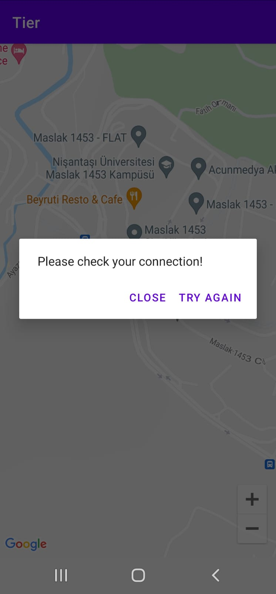

# TIER - Test Case

    

A demonstration modern Android development project with ViewModel, Navigation, Hilt, Retrofit and based on MVVM by using Google Maps.

## ℹ Introduction

Tier is an android based mobile application that  shows the company's available vehicles (scooter, bicycle, moped) 
on the map with their availability such as location charge level, does contain helmet box and etc.

Each type of vehicle has shown by different marker icon on the map. 
By using cluster technology vehicles can be grouped as numbers which symbolize available amount of vehicles on specific location.

Users can also see their own location  on the map to compare closest vehicle.

## What You Will Need

*Hardware Requirements*
- A computer that can run Android Studio.
- An Android phone for debugging.

*Software Requirements*
- Android SDK package
- Android Studio 4.X

## 🛠 Features

- Show vehicles on map
- Show vehicles as cluster groups
- Give vehicle info by clicking marker
- Show user's location

## 📱 Screenshots

<p align="center">
  
  
  
</p>

<p align="center">
  
  
  
</p>


## 🏗 Tech Stack

### Architecture

- 100% Kotlin based, including Gradle files
- MVVM Architecture
- Repository Pattern

### Libraries

- Minimum SDK level 21 + based on [Kotlin](https://kotlinlang.org/)

- [Coroutines](https://github.com/Kotlin/kotlinx.coroutines)

- [Hilt](https://dagger.dev/hilt/) - for dependency injection

- Jetpack Libraries
    - [Lifecycle](https://developer.android.com/jetpack/compose/lifecycle) - Observe lifecycle state changes
    - [ViewModel](https://developer.android.com/topic/libraries/architecture/viewmodel) - Store UI related data

- [Retrofit Client](https://square.github.io/retrofit/) - Execute network service calls
- [Easy Permission Handler](https://github.com/googlesamples/easypermissions) - For Permission handling
- JUnit4

### Services

- [Google Maps](https://developers.google.com/maps) - Google Maps docs 🌍

## How to get the Google MAPS API key?

Register [here](https://developers.google.com/maps) and get your own Google Maps API key for your builds.

## License

```xml
Designed and developed by cenkcavga (Cenk Faruk Cavga)

    Licensed under the Apache License, Version 2.0 (the "License");
    you may not use this file except in compliance with the License.
    You may obtain a copy of the License at

    http://www.apache.org/licenses/LICENSE-2.0

    Unless required by applicable law or agreed to in writing, software
    distributed under the License is distributed on an "AS IS" BASIS,
    WITHOUT WARRANTIES OR CONDITIONS OF ANY KIND, either express or implied.
    See the License for the specific language governing permissions and
    limitations under the License.
```
